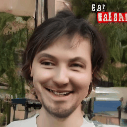
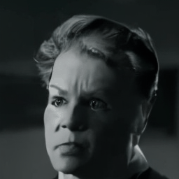
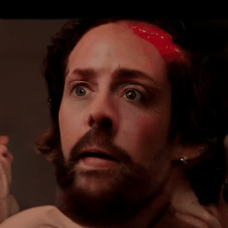
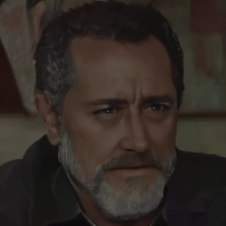

## Face Video Generation Project With Flow Matching
Trained an unconditional latent flow matching model from scratch to generate 16 frame videos of faces. It was trained on the CelebVQ dataset of around 35K celebrity faces (https://celebv-hq.github.io/). Generated videos aren't of the best quality, but demonstrate learned structure and temporal coherence. The next step would be to do a more comprehensive evaluation of generation quality.

## Technical details
Used a 381M parameter video Diffusion Transformer with 20 layers and 16 attention heads as the backbone. Trained with rectified flow matching. 
For sampling used Euler ODE solver with 50 steps. It was latent flow matching, so the pretrained Stable Diffusion VAE was used to encode 256x256x3 frames into 32x32x4 latent resolution (and decode them after).

For conditional training we conditioned on the emotion class with 10% CFG dropout. Samples were generated with a CFG value of 4.0.

## Generated samples (epoch 159, unconditional)

| | | | |
|:---:|:---:|:---:|:---:|
|  |  |  |  |

## Generated samples (epoch 150, conditional training)

## Happy
  

## Anger
  

## Surprise
 

## Disgust
  

## Training Curve (Unconditional)

 
